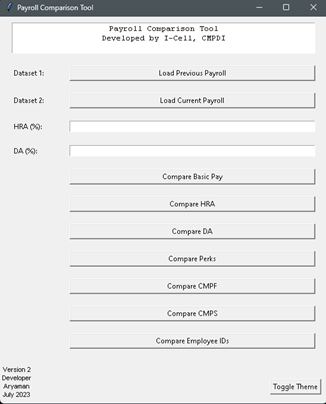

# Payroll Comparison Tool

The Payroll Comparison Tool is a Python-based application that helps human resources and payroll professionals efficiently compare two sets of payroll data. It enables users to identify differences in salary components, allowances, and other benefits between two payroll periods, making the payroll auditing process faster and more manageable.




## Features

- **User-Friendly Interface**: The tool provides an intuitive graphical interface to easily load and compare payroll datasets.

- **Data Comparison**: Compare salary components such as Basic Pay, HRA, DA, Perks, CMPF, CMPS, and Employee IDs.

- **Threshold Configuration**: Customize threshold values for specific comparisons like HRA or DA, allowing better control over what is considered a discrepancy.

- **Export Comparison Results**: Save the comparison results as an Excel file for documentation and future reference.

## Installation

To use the Payroll Comparison Tool, follow these installation steps:

1. Clone this repository to your local machine:

   ```
   git clone https://github.com/your_username/payroll-comparison-tool.git
   ```

2. Navigate to the project directory:

   ```
   cd payroll-comparison-tool
   ```

3. Set up a virtual environment (optional but recommended):

   ```bash
   python -m venv venv
   venv\Scripts\activate   # On Windows
   source venv/bin/activate   # On macOS and Linux
   ```

4. Install the required dependencies:

   ```
   pip install pandas numpy pillow openpyxl tk
   ```

## Usage

Follow these steps to run the Payroll Comparison Tool:

1. Run the application:

   ```bash
   python payroll_comparison_tool.py
   ```

2. Load the previous payroll dataset using the "Load Previous Payroll" button.

3. Load the current payroll dataset using the "Load Current Payroll" button.

4. Select the comparison type from the available options (e.g., Basic Pay, HRA, DA, Perks, CMPF, CMPS, Employee IDs).

5. Configure any specific thresholds (e.g., for HRA or DA comparison) if applicable.

6. Click the corresponding "Compare" button to perform the comparison.

7. The results will be displayed in a new window, and you can save the comparison data as an Excel file.

## Converting into a Standalone Executable

To convert the Payroll Comparison Tool into a standalone executable application, you can use PyInstaller. PyInstaller bundles the Python application and its dependencies into a single executable file, making it easy to distribute and run without requiring a Python interpreter.

Follow these steps to create the executable:

1. **Set Up Virtual Environment (Optional but Recommended)**

   First, create a virtual environment to isolate the project's dependencies from your system-wide Python installation:

   ```bash
   python -m venv venv
   ```

   On Windows, activate the virtual environment:

   ```bash
   venv\Scripts\activate
   ```

   On macOS and Linux:

   ```bash
   source venv/bin/activate
   ```

2. **Install Required Dependencies**

   Ensure you are in the project directory and install the necessary dependencies using `pip`:

   ```bash
   pip install pandas numpy pillow pyinstaller openpyxl tk
   ```

3. **Create Standalone Executable**

   Once all the dependencies are installed, you can use PyInstaller to create the standalone executable:

   ```bash
   pyinstaller --onefile payroll.py
   ```

   PyInstaller will bundle the Python application and its dependencies into a single executable file.

4. **Locate the Executable**

   After the build process completes, navigate to the `dist` directory inside your project folder. You will find the standalone executable there.

   - On Windows, the executable will have a `.exe` extension (e.g., `payroll.exe`).
   - On macOS, it will be an application bundle (e.g., `payroll.app`).
   - On Linux, it will be a binary file without an extension (e.g., `payroll`).

5. **Run the Standalone Executable**

   To execute the standalone application, double-click the `.exe` file on Windows, the application bundle on macOS, or run the binary file on Linux.

   The application should launch without needing a Python interpreter or any additional dependencies.

Now you have successfully created a standalone executable for the Payroll Comparison Tool, allowing users to run the tool on compatible systems without requiring Python or any external libraries.

## Contributing

If you find any issues or have suggestions for improvement, feel free to create a new issue or submit a pull request.

## License

This project is licensed under the MIT License. See the [LICENSE](LICENSE) file for details.

